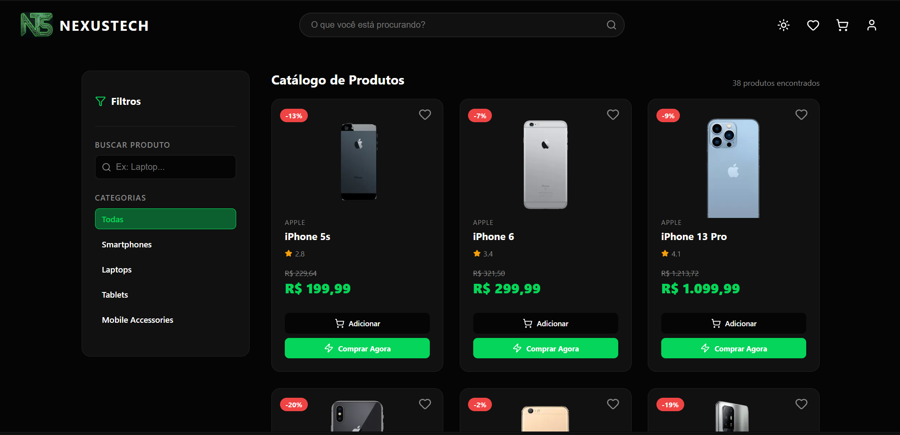
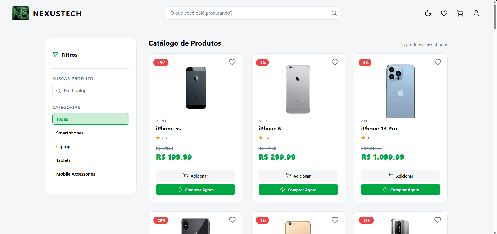
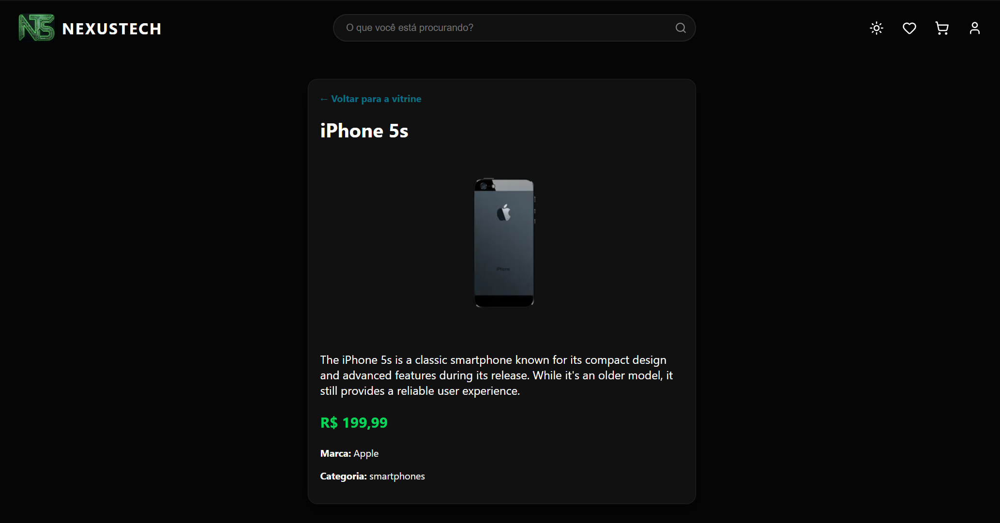
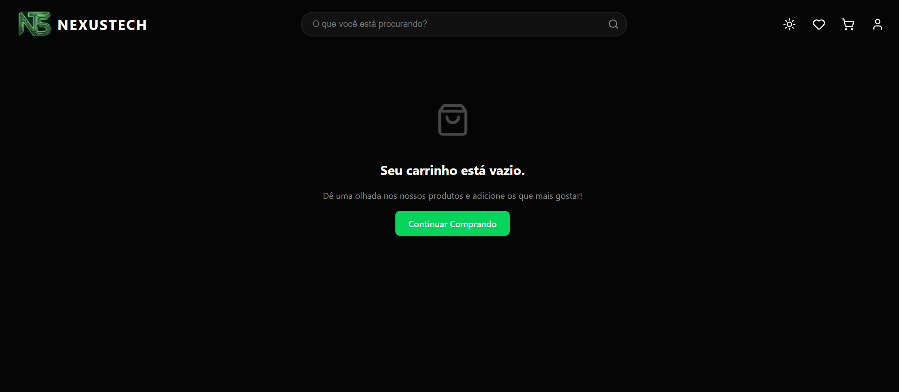
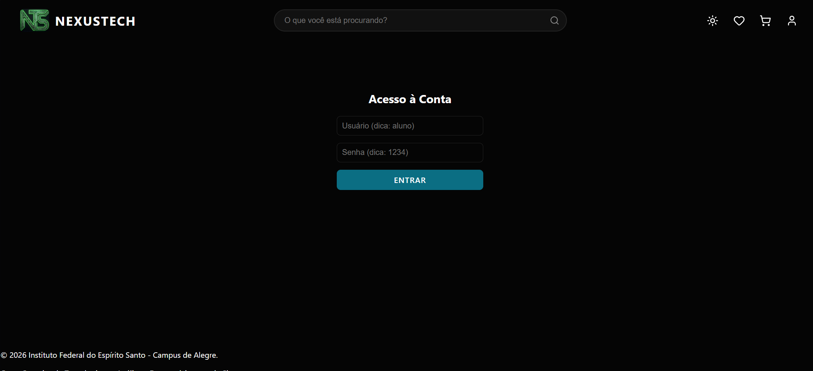
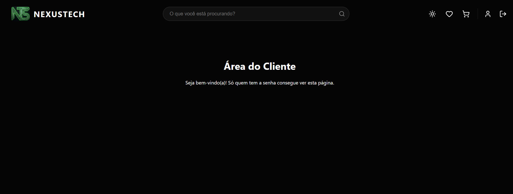

# 🚀 NexusTech Store - Projeto Integrador

## 🌐 Deploy

✨ **Veja o projeto em funcionamento:** [Acessar Demonstração (Vercel)](https://tads-store-gccavalcante.vercel.app/)

---

## 📝 Descrição
O **NexusTech Store** é uma Single Page Application (SPA) de e-commerce focada em eletrônicos e hardware de alta performance. Desenvolvido como requisito avaliativo para o **Projeto Integrador do curso de Tecnologia em Análise e Desenvolvimento de Sistemas (TADS)**, o sistema simula um ambiente real de compras online, utilizando React e integrando dados dinâmicos de serviços externos.

---

## ✨ Funcionalidades Implementadas

### 📦 1. Consumo de API Externa e Filtros (Vitrine)
- Conexão em tempo real com a **API DummyJSON**, realizando buscas paralelas via `Promise.all` exclusivamente em categorias tecnológicas (`smartphones`, `laptops`, `tablets`, `mobile-accessories`).
- Tratamento explícito de estados de **Carregando (Loading)** e **Erro** na interface.
- Sistema duplo de busca: pesquisa global via cabeçalho (utilizando `useSearchParams` do React Router) e filtros locais por texto e categoria na barra lateral.

### 🛒 2. Gerenciamento de Carrinho e Compras
- Adição de produtos ao carrinho com incremento automático de quantidade para itens duplicados.
- Atualização dinâmica de quantidades, exclusão de itens e cálculo em tempo real do valor total do pedido.
- Opção de "Comprar Agora" que adiciona o item diretamente ao carrinho e redireciona o usuário para o fluxo de finalização.

### 🔐 3. Autenticação e Proteção de Rotas
- Sistema de login com persistência de sessão utilizando `localStorage`.
- Componente `RotaPrivada.jsx` que intercepta acessos não autorizados à Área do Cliente (`/minha-conta`) e redireciona o usuário de forma segura para a tela de autenticação.

### 📍 4. Integração de Serviços no Checkout
- Integração com a **API ViaCEP** na tela de finalização de compra.
- Ao digitar um CEP válido de 8 dígitos, o sistema realiza uma requisição assíncrona, tratando erros e preenchendo os campos de Logradouro, Bairro, Cidade e UF de forma totalmente automatizada.

### 🎨 5. Identidade Visual Premium e Tema Claro/Escuro
- Visual inspirado em circuitos tecnológicos com paleta focada em preto profundo e verde neon.
- Cabeçalho imersivo fixo (`sticky`) sempre escuro e opaco para preservar a força da marca.
- Suporte completo a **Light Mode** e **Dark Mode** via variáveis CSS no corpo da página, assegurando contraste rigoroso e legibilidade total dos textos.

---

## 🚀 Como Executar o Projeto

Certifique-se de possuir o [Node.js](https://nodejs.org/) instalado em seu ambiente local.

1. **Clone o repositório para sua máquina:**
   ```bash
   git clone https://github.com/gccavalcante/tads-store
2. Acesse o diretório do projeto:
   ```bash
   cd tads-store
3. Instale todas as dependências necessárias:
   ```bash
   npm install
4. Inicie o servidor de desenvolvimento local:
   ```bash
   npm run dev
   
## 📸 Galeria do Projeto
Abaixo, confira algumas das principais telas da **NexusTech Store**:

| Vitrine de Produtos |
| :---: |
|  |
|  |
 
 | Detalhes do Produto |
| :---: |
|  |

| Carrinho de Compras |
| :---: |
|  |

| Área de Acesso (Login) |
| :---: |
|  |

| *Área restrita* |
| :---: |
|  |
